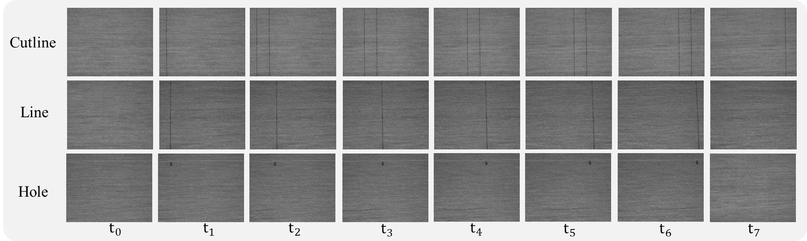
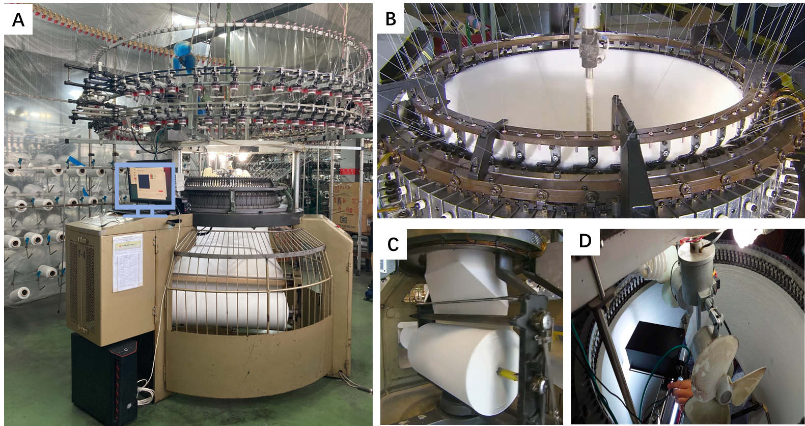
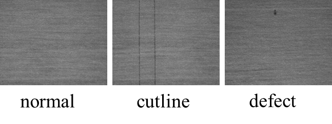
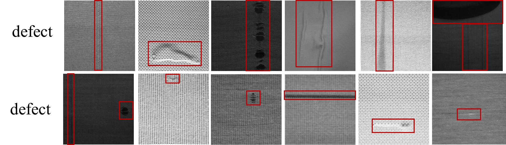

# Time-series circula knitting dataset, 
週期針織布數據集第一版
----台灣中央大學智慧軟體系統實驗室

## 週期針織布數據集第一版介紹
週期針織布數據集第一版由台灣中央大學智慧軟體系統實驗室整理並開源, 共三種針織布類型.该数据集共包含无缺陷样本图像13500张，缺陷样本图像330张，图像的分辨率为800*840*1。

## 取樣系統
在 **圓形針織機 (Circular Knitting Machine)** 的生產環境中，存在機器的高速運轉和織物的特殊結構, 織物在生產過程中以圓筒狀的形式織出來，如圖所示 [Fig. 1-C](img_10.png)，在生產後需要進行裁剪以將圓筒狀織物展開成平面狀的成品布匹。

### 裁切線 (Cutline) 的作用
為了幫助在生產後進行精確的裁剪，**圓形針織機** 會在固定的位置設置兩條漏針來形成 **裁切線 (Cutline)**。這些裁切線本身是設計中的一部分，用於引導布匹的裁剪，並非織物缺陷。然而，這些裁切線在外觀上與一些常見的缺陷（如垂直線缺陷 v-line）非常相似，因此在進行實時缺陷檢測時，區分這些裁切線與真正的缺陷是一個關鍵挑戰。

不同類型data在週期上的影像呈現

### 取樣設備
使用工業黑白相機 (Industrial Black-and-White Camera) 取樣， 相機位於針織機內部[Fig. 1-D](img_10.png),由於相機沒有感光元件, 拍攝的影像容易受到光照條件的影響。由於相機只能捕捉灰度信息而無法分辨顏色, 同一布匹在不同光照下呈現不同的色階.

### 完整的取樣系統
取樣系統由多個組件組成，協同工作以實現精確的實時缺陷檢測。具體如下：

1. **邊緣伺服器 (Edge Server)**：
   - 所有捕獲的影像都會被傳送到伺服器進行處理。
   
2. **工業黑白相機 (Industrial Black-and-White Camera)**：
   - 相機在布匹生產的過程中，以每 30 毫秒的快門速度實時捕捉織物的圖像。這樣的高頻率取樣有助於確保每個生產週期內的織物細節都能被捕捉到。

    
## 資料集結構
每個資料集包含來自相同針織機器的織物影像，影像分辨率為 640 × 800 像素，拍攝速率為每秒 30 幀 (FPS)。相機與織物表面的距離約為 15 公分，後續的影像被縮小到 320 × 400 像素，並傳送到邊緣伺服器進行缺陷分割處理。
影像的拍攝條件主要分為兩類：
+ 均勻照明 (Uniform Illumination)
+ 不均勻照明 (Uneven Illumination)

資料集中包括三種不同的針織織物紋理，分別標示為 Texture 1（針型ABAB类），Texture 2（針型4角PK类）和 Texture 3（針型4角PK类）三类花型，並依據照明條件進行劃分，總共有六個資料集：

+ Dataset 1: Texture 1, 照明1
+ Dataset 2: Texture 2, 照明2
+ Dataset 3: Texture 3, 照明3
+ Dataset 5: Texture 1, 照明4
+ Dataset 4: Texture 2, 照明5
+ Dataset 6: Texture 3, 照明6

如下圖所示:

##  影像類型
影像分為三種類型：

+ 正常影像 (Normal): 無缺陷的織物影像
+ 切線影像 (Cutline): 影像中有意設置的切線，並非缺陷
+ 缺陷影像 (Defect): 含有缺陷的織物影像

如下如所示:

## 訓練和測試數據集劃分
每個資料集的訓練集均包含30張隨機選取的影像，其中包括：

+ 15 張正常的織物影像
+ 15 張帶有切線的織物影像

測試集的影像則按照序列進行收集，以反映真實工業流程中的動態特性。下個表格中提供了詳細的訓練和測試數據集劃分：

| Dataset  | 照明條件     | 紋理類型   | 訓練集 (正常/切線) | 測試集 (正常/切線/缺陷) |
|----------|--------------|------------|--------------------|------------------------|
| Dataset1 | 均勻照明     | Texture 1  | 15 / 15             | 5000 / 172 / 49         |
| Dataset2 | 均勻照明     | Texture 2  | 15 / 15             | 1742 / 64 / 21          |
| Dataset3 | 均勻照明     | Texture 3  | 15 / 15             | 4290 / 148 / 42         |
| Dataset4 | 不均勻照明   | Texture 1  | 15 / 15             | 1755 / 67 / 145         |
| Dataset5 | 不均勻照明   | Texture 2  | 15 / 15             | 1580 / 59 / 16          |
| Dataset6 | 不均勻照明   | Texture 3  | 15 / 15             | 1100 / 40 / 34          |

## 影像數據總數
這六個資料集中總共包含 16414 張影像，其中包括帶有缺陷樣本的影像。

## 影像範例圖

defect-free 樣本圖

瑕疵樣本圖

## 文件結構
週期針織布數據集CKD-1文件夹中，包含 Texture 1（針型ABAB类），Texture 2（針型4角PK类）和 Texture 3（針型4角PK类）三类布匹型號。
这三類別分别放置于三个文件夹，依次命名为Texture 1，Texture 2，Texture 3，总结构如图所示。

每种針織布類型的数据集文件包含训练集train和测试集test两个子文件夹。其中，训练集为无缺陷样本和週期出現cutline樣本,放置于defect-free文件夹, 對應标记缺陷区域放置于groundtruth；
测试集为週期出現样本circular及标记缺陷区域的groundtruth, 裡面包含defect-free, 週期出現cutline以及有缺陷样本defect。以ABAB花型为例，它的文件结构图如下圖所示。

## 下載

稍後公佈
